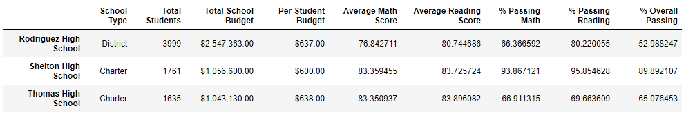

## Overview of Project:
 In this project, we analysed datas-set from a variety of sources and formats to informed a school board for their discussions and strategic decisions. 
 We aggregated datas to showcase trends and schools performance regarding schools budgets, reading and math score, sizes and priorities. We did this analysis first for all the schools datas and then by replacing the 9th grade reading and math scores for Thomas High School. 

## Results: 

For this work, we analyse 7 school district metrics, and how they got affected by changes in the data. 
- District summary:
  - After taken out the 9th grade reading and math scores of Thomas High School, we analysed that the budget, average math and reading score were not affected by the data change. In an other hand, the % of passing math and reading score, as well as the % of overall passing were slightly lower. 
   
   
  
- School summary:
  - Excluding the 9th grade values of Thomas High School affected significantly the school summary, we Analysed that:
    - The & of passing maths decreased by ~25 %.
    - The % of passing reading decreased by ~28 %.
    - The % of overall passing decreased by ~25 %. 
   
   
   
- Performance relative to other school:
  - Before replacing the 9th grade reading and math score, Thomas High School was in 2nd position based on the % of overall passing, after Thomas High School was in 8th positions. 

- Math and reading scores did not get affected by the replacement of the 9th grade score except for Thomas High School who's 9th grade score was replaced by NaN. 
  

- No changes occurred for the score by school spending per student. 
- The scores by school size has been affected by the replacement of Thomas High School 9th grade values for the % of passing math and reading, the % of overall passing, but only for the medium size school (~5% lower). 
  
  
 
- The score by school type remained the same before and after replacing 9th grade values. 

### Summary:

Some Majors changes occurred after replacing the scores of math and reading for the 9th grade of Thomas High School:
- Thomas High School went down from the 2nd position to the 8th position in the school list with decreasing of ~25 % of the reading and math score % and his overall passing %, that's before we recalculated the % of reading and math passing as well as the % of overall passing with only the scores from 10-12th grades(went back up then). 
- The district summary % of overall passing drop slightly. 
- Thomas High School has been the only charter type school with a low overall passing. 
- The medium size school % of overall passing decreased by ~5 %. 
- Thomas High School did not have a 9th grade score anymore(replaced by NaN). 